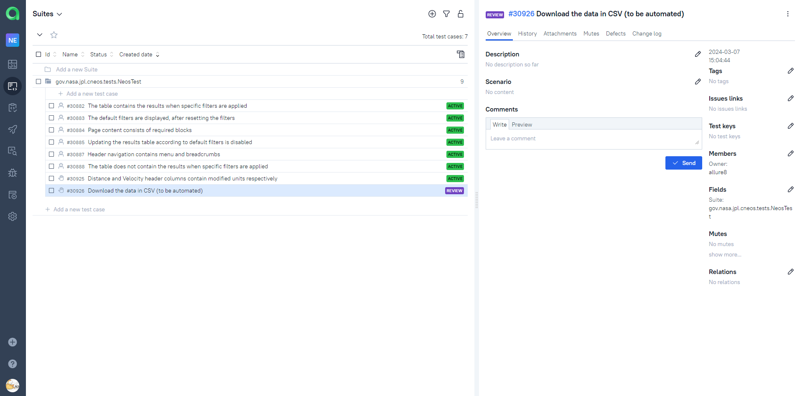

# Test UI automation project for [CNEOS](https://cneos.jpl.nasa.gov/)


## About CNEOS
The Center for Near-Earth Object Studies (CNEOS) computes high precision orbits for Near-Earth Objects (NEOs), predicts their future motions, assesses their impact hazard, and makes these result available on this website.

## Contents
- <a href="#technologies">Tools and technologies</a>
- <a href="#testcases">Executed automation test cases</a>
- <a href="#running">Running Autotests</a>
- <a href="#report">Allure Report</a>
- <a href="#testops">Allure TestOps integration</a>
- <a href="#jira">Jira integration</a>
- <a href="#telegram">Telegram notifications via bot</a>
- <a href="#video">Selenoid video of test run</a>

<a id="technologies"></a>
## Tools and technologies
 Java                                                                                                       | IntelliJ  <br>  Idea                                                                                               | GitHub                                                                                                     | JUnit 5                                                                                                           | Gradle                                                                                                     | Selenide                                                                                                         | Selenoid                                                                                                                  | Allure <br> Report                                                                                                         |  Jenkins                                                                                                        |   Jira                                                                                                              | Telegram                                                                                                            |Allure <br> TestOps                                                                                                          
|:----------------------------------------------------------------------------------------------------------|--------------------------------------------------------------------------------------------------------------------|------------------------------------------------------------------------------------------------------------|-------------------------------------------------------------------------------------------------------------------|------------------------------------------------------------------------------------------------------------|------------------------------------------------------------------------------------------------------------------|---------------------------------------------------------------------------------------------------------------------------|----------------------------------------------------------------------------------------------------------------------------|-----------------------------------------------------------------------------------------------------------------|---------------------------------------------------------------------------------------------------------------------|---------------------------------------------------------------------------------------------------------------------|----------------------------------------------------------------------------------------------------------------------------------:|
| <a href="https://www.java.com/"></a>  | <a href="https://www.jetbrains.com/idea/"></a> | <a href="https://github.com/"></a> | <a href="https://junit.org/junit5/"></a> | <a href="https://gradle.org/"></a> | <a href="https://selenide.org/"></a> | <a href="https://aerokube.com/selenoid/"></a> | <a href="https://github.com/allure-framework"></a> |<a href="https://www.jenkins.io/"></a> | <a href="https://www.atlassian.com/software/jira/"></a> | <a href="https://web.telegram.org/"></a> |<a href="https://qameta.io/"></a> |
- To create autotests in this project the <code>[Java](https://www.java.com/)</code> language was used.
- <code>[Gradle](https://gradle.org/)</code> was used as an automatic build system.
- Frameworks <code>[JUnit5](https://junit.org/junit5/)</code> and <code>[Selenide](https://selenide.org/)</code> for automated testing of web applications have been applied.
- Browsers were launched via <code>[Selenoid](https://aerokube.com/selenoid/)</code>.
- To run tests remotely a job was implemented in <code>[Jenkins](https://jenkins.autotests.cloud/job/MaryPimenova-VacancyProjectUnit14/)</code> with the creation of an <code>[Allure-report](https://jenkins.autotests.cloud/job/MaryPimenova-VacancyProjectUnit14/7/allure/)</code> and sending the results to <code>[Telegram](https://web.telegram.org/)</code> using special Telegram bot.
- Integrations with с <code>[Allure TestOps](https://allure.autotests.cloud/project/2434/dashboards)</code> and <code>[Jira](https://jira.autotests.cloud/browse/HOMEWORK-720)</code> were implemented.

<a id="testcases"></a>
## Executed automation test cases
- Header navigation contains menu and breadcrumbs
- Page content consists of required blocks
- Updating the results table according to default filters is disabled
- The default filters are displayed, after resetting the filters
- The table contains the results when specific filters are applied
- The table does not contain the results when specific filters are applied
- Distance and Velocity header columns contain modified units respectively (Parameterized using the @CsvSource annotation)

<a id="running"></a>
## Running Autotests

### Local run
```
gradle clean test -Denv=local 
```

### [Remote Jenkins run](https://jenkins.autotests.cloud/job/near-earth-object-tests/)
```
gradle clean test -Denv=remote 
```

#### Properties are retrieved from the corresponding configuration file (depending on the value of `env`):

```
./resources/config/${env}.properties
```

<a id="report"></a>
##  [Allure Report](https://jenkins.autotests.cloud/job/near-earth-object-tests/7/allure/)
 
 

<a id="testops"></a>
##  [Allure TestOps integration](https://allure.autotests.cloud/project/4112/dashboards)
 
 

<a id="jira"></a>
##  [Jira integration](https://jira.autotests.cloud/browse/HOMEWORK-1153)
 

<a id="telegram"></a>
## Telegram notifications via bot 
  

<a id="video"></a>
## Selenoid video of test run
 